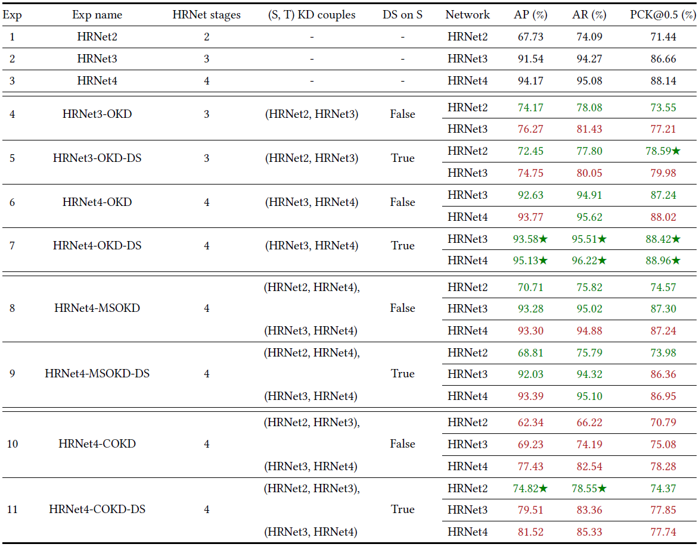

# Online Knowledge Distillation and Deep Supervision for Preterm Infants' Pose Estimation

This is the official repository of the ACM Health paper ["Online Knowledge Distillation and Deep Supervision for Preterm Infants' Pose Estimation: A Research Guided by the Principles of Green AI"](https://doi.org/10.1145/3757067).

## Project Structure

```
.
├── __init__.py
├── data
├── experiments
├── lib
├── pretrained
├── test.py
├── tools
└── train.py
```

## Setup and Installation

### 1. Environment Setup
To run this project, you need to install the dependencies in a Python virtual environment:

```bash
# Create a virtual environment
python -m venv venvhpe

# Activate the virtual environment
source venvhpe/bin/activate  # On Linux/macOS
# or
venvhpe\Scripts\activate  # On Windows

# Install dependencies
pip install -r requirements.txt
```

### 2. Dataset
An older version of the dataset is available on [Zenodo](https://zenodo.org/records/3891404). You can contact the authors for access to the latest version used in this work, which has not yet been publicly released.

### 3. Pretrained Models
You can download pretrained models from:
- **Google Drive**: https://drive.google.com/drive/folders/14p2l1u19bLOm5p6esKyolYJyfE1_inLv
- **OneDrive**: https://1drv.ms/f/s!AhIXJn_J-blW231MH2krnmLq5kkQ

*Note: These links are from the original HRNet repository. Place them in the `pretrained` directory.*

## Usage

### Training
To train the model, run the following command with your desired configuration file:

```bash
python train.py --cfg experiments/babypose/hrnet/DESIRED_CONFIG_FILE.yaml
```

Available configuration files in `experiments/babypose/hrnet/`:
- `2_stage_coco_lr_7-5e-4.yaml`
- `3_stage_coco_dist_23_lr_7-5e-4_kld.yaml`
- `4_stage_coco_dist_34_lr_7-5e-4_kld.yaml`
- ...
which includes the configurations in Table 1 of the paper as well as other trials. "dist" in the filename indicates the use of knowledge distillation, while "mse" indicates the use of deep supervision (DS).


### Testing
To test the model, run the following command with the same configuration file used for training:

```bash
python test.py --cfg experiments/babypose/hrnet/DESIRED_CONFIG_FILE.yaml
```

### Acknowledgments
The research was carried out thank to the contribution from the "ITALIAN FUND FOR APPLIED SCIENCES" (FISA) grant n°FISA2022-00696
